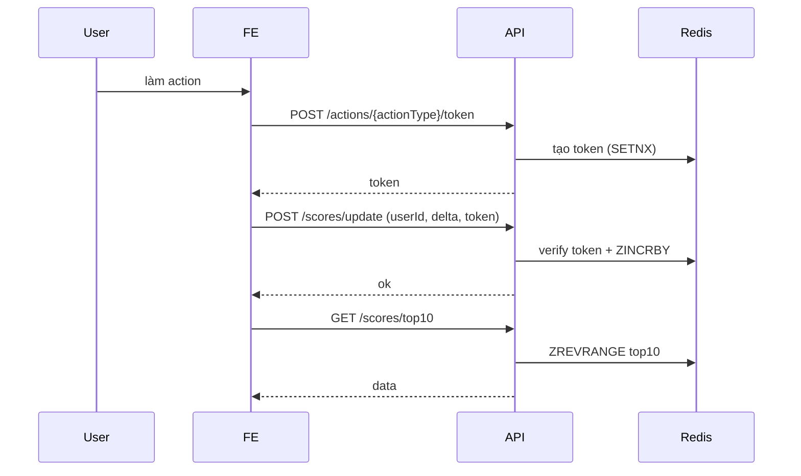

# README (scoreboard API)

## Mục tiêu

Website có **score board** (top 10 user), khi user làm 1 action thì score tăng và bảng điểm cập nhật realtime.

## Flow
1. User làm 1 action nào đó.
2. FE sẽ gọi API xin 1 cái action-token === đảm bảo ko fake score.
3. FE gửi request update score lên server kèm token.
4. BE check token, nếu hợp lệ thì tăng score trong DB/Redis.
5. Score board top 10 đc đẩy ra cho client (qua WebSocket, Socket.io hoặc Short polling, cái này em chưa rõ best cách nào).

## API Endpoints

* `POST /api/actions/{actionType}/token`

  * desc: phát token cho client, token này chỉ dùng 1 lần.
  * có rate limit (đỡ spam), limit cụ thể em chưa biết config ra sao.
  * response: `{ token: string, expiresAt: number }`

* `POST /api/scores/update`

  * body: `{ userId, scoreDelta, token }`
  * BE verify token → nếu ok thì `ZINCRBY` trong Redis.

* `GET /api/scores/top10`

  * trả về list 10 user có điểm cao nhất.

## Security (important)

* Token chỉ xài 1 lần, expire nhanh (vd 30s).
* Redis script (Lua) để làm atomic increment + check token.
* Thêm rate limit để user ko spam request.
* Chắc phải log lại hành vi bất thường (em note nhưng chưa biết tool nào phù hợp ^.^).

## Diagram (Mermaid)



## OpenAPI

```yaml
paths:
  /api/actions/{actionType}/token:
    post:
      summary: Get action token
      responses:
        '200': { description: ok }
  /api/scores/update:
    post:
      summary: Update score
  /api/scores/top10:
    get:
      summary: Top10 scoreboard
```

## Env sample

```
PORT=3000
REDIS_URL=redis://localhost:6379
JWT_SECRET=supersecret (nếu xài jwt cho token)
```
## Chỗ còn hơi mơ hồ

* websocket em chưa rành lắm, nên chắc cần 1 anh chị trong team setup.
* rate limit nên config ở nginx hay trong code? em thiên về nginx.
* BE có cần notify FE bằng push ngay khi score thay đổi không, hay polling là đủ?
